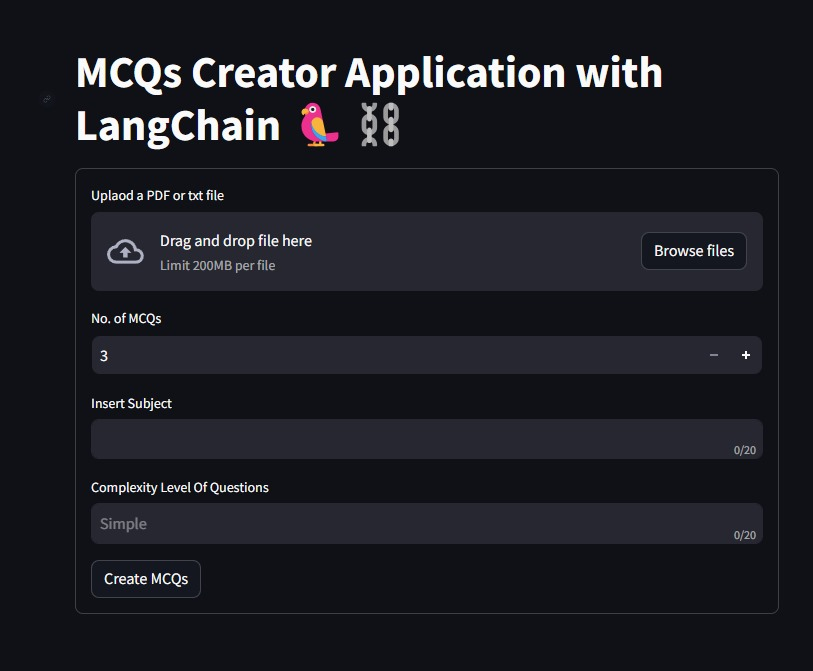

# MCQ Generator with OpenAI API 🤖

This project is a simple Multiple Choice Question (MCQ) generator powered by the OpenAI API. It allows users to upload a PDF or text file, specify the number of MCQs to generate, choose a subject, and set the complexity level of the questions.

## Features

- Upload PDF or text files.
- Generate a specified number of MCQs.
- Specify the subject and complexity level of the questions.
- Utilizes the OpenAI API for text generation.

## Setup

- clone the repository
- create .env and specify openAI_KEY
- pip install -r requirements.txt

## Usage

- streamlit run streamlitapp.py

